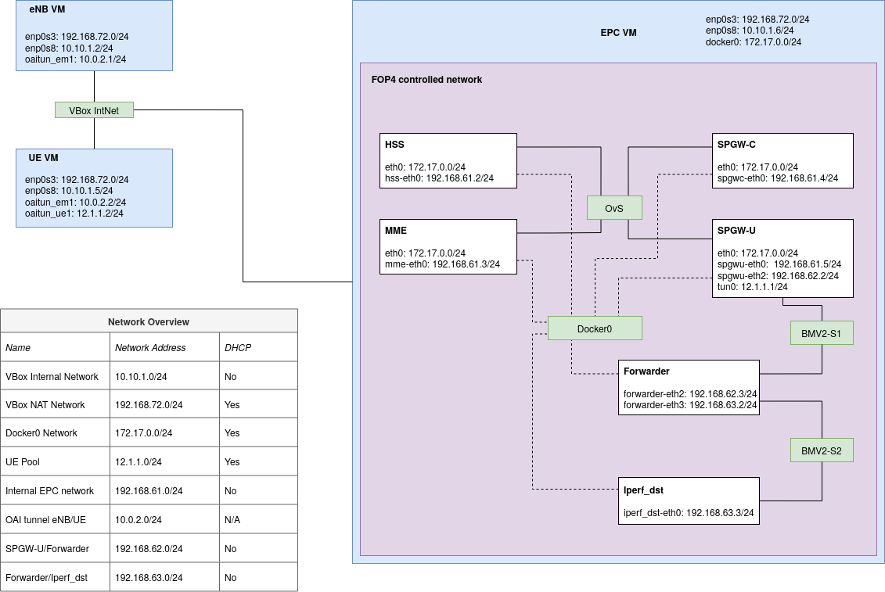

# ACIT5930-artefact
OAI 4G RAN and EPC running in VBox

### Purpose of this project
This is the artefact for my Master project in Applied Computer and Information Technology, with a specialisation in Cloud-based Services and Operations. The thesis aims to investigate the performance impact of In-Band Network Telemetry (INT) on a 4G LTE EPC realized as Virtualized Network Functions (VNF). The repository contains all the necessary code and scripts to deploy a functional RAN and EPC in a VirtualBox environment.

### Requirements
Hardware requirements:
- At least 16GB of RAM
- Ideally a 4-core CPU with Hyperthreading or Simultaneous Multi Threading (i.e. Intel or AMD)
- At least 120GB of free storage. RAN and UE VMs require 20GB each, the EPC VM requires 50GB.

The setup has been tested on the following specs:
- Ryzen 5 2600X 6-core @3.8GHz
- 32GB DDR4 RAM
- 960GB HDD

Platform:
- OS: Ubuntu 18.04.5 LTS x86_64
- Kernel version: 5.4.0-71-generic

Software:
- Vagrant 2.2.10
- VirtualBox 6.1.xx
- Any other dependency will be handled by Vagrant on the specific Virtual machines

Recommended knowledge:
- Some experience with P4, Mininet, the OAI RAN and EPC projects.
- Experience with Tmux for an easier time with multiple terminals to multiple VMs
- Experience with Vagrant and multi-machine setups in this environment
- Solid knowledge in computer networks
- Knowledge of how LTE networks operate with IMSI, MSIN, HPLMN, OPC, and USIM_API_K parameters.

Final setup overview: 

# Build Instructions
- **NOTE**: Before the UE can be fully configured, you must have the correct OPC. This is generated by the HSS based on the LTEK and can be seen in the logs of the HSS container after service configuration and startup.
- **NOTE**: For first time use, the VMs must be deployed in a specific order, starting with the EPC, followed by the eNB VM and finally the UE VM.
- **NOTE**: We have set up a new user account on every VM with username/password `netmon`. Everything is set up from this user's home folder.
- As you deploy the VMs, use `vagrant ssh <VM name>` to connect.

### Configuring EPC
Start by using `vagrant up epc`. This process can take up to 90 minutes if not more. The bootstrap script will set up the user account, pull the relevant repositories, build the EPC component's Docker images, and finally install P4 with all relevant dependencies such as Mininet and the BMV2 switch. The installation script for P4 is one of the scripts provided by [jafingerhut](https://github.com/jafingerhut/p4-guide/blob/master/bin/install-p4dev-v2.sh).

- When the deployment is complete, we can install FOP4 with Ansible. SSH to the VM:
  ```bash
    vagrant ssh epc
    su netmon
    # password: netmon
    cd ~

    # Instructions are also available in the repository: https://github.com/vetletm/FOP4/tree/vetletm-fix-ansible
    sudo apt-get install ansible git aptitude
    cd ~/src/FOP4/ansible/
    sudo ansible-playbook -i "localhost," -c local install.yml
    cd ..
    sudo python setup.py install
  ```
- **NOTE**: Every Topology script must be run from within the FOP4 directory context. It does not set up the correct paths for Python to recognize it as a common library.
- When FOP4 is installed, move the topology script files from `topologies/` in this repo to the FOP4 directory on the EPC VM. Vagrant shares its initialized folder with any created VMs.
- From the EPC VM:
  ```bash
    # Topology scripts
    cp /vagrant/topologies/* ~/src/FOP4/
    # P4 programs
    cp /vagrant/p4/* ~/src/FOP4/
    # Control scripts to make management of EPC components easier:
    cp /vagrant/scripts/epc_config.sh ~/src/openair-components
    cp /vagrant/scripts/epc_start.sh ~/src/openair-components
    cp /vagrant/scripts/epc_stop.sh ~/src/openair-components
    cp /vagrant/scripts/epc_collect.sh ~/src/openair-components
    cp /vagrant/scripts/epc_pcap.sh ~/src/openair-components
    cp /vagrant/scripts/metric_collection.sh ~/src/archives
  ```
  It is a good idea to compile all the P4 programs before you move on:
  ```bash
    p4c --target bmv2 --arch v1model forwarder.p4
    p4c --target bmv2 --arch v1model timestamping.p4
    p4c --target bmv2 --arch v1model ploss.p4
  ```
  Each of these commands will spawn a json file with the same name as the P4 file, but with the `.json` extension instead of `.p4`, e.g. `forwarder.json`, `timestamping.json`, etc.
- Before you can move on the next step, build two docker images for the Forwarder and Iperf_dst containers:
  ```bash
    cp /vagrant/scripts/Dockerfile.testbed ~/src/openair-components
    cd ~/src/openair-components
    sudo docker build --tag forwarder:1804 --file Dockerfile.testbed .
    sudo docker build --tag iperf_dst:1804 --file Dockerfile.testbed .
  ```

**Test FOP4**:
- In order to let the Forwarder and Iperf_dst containers to communicate with the SPGW-U, you must first compile the basic forwarder P4 program:
  ```bash
    cd ~/src/FOP4
    p4c --target bmv2 --arch v1model forwarder.p4
  ```
- This will spawn a `forwarder.json` file, which is used in the `monitoring_nothing.py` topology script. **NOTE: If you want to use a custom P4 program, replace the json-parameter in lines 60 and 61 in the topology scripts**.
  ```python
    info('*** Adding BMV2 switches\n')
    s2 = net.addSwitch('s2', cls=Bmv2Switch, json='./forwarder.json', switch_config='./s2f_commands.txt')
                                                  ^^^^^^^^^^^^^^^^^ HERE
    s3 = net.addSwitch('s3', cls=Bmv2Switch, json='./forwarder.json', switch_config='./s3f_commands.txt')
                                                  ^^^^^^^^^^^^^^^^^ AND HERE
  ```
  Also note that if you want to use custom configuration commands on the BMV2 switches, write them to a txt file and replace the `switch_config` parameter with the name of this file.

- The Docker Images should be built correctly, so go ahead and start a basic topology:
  ```
    sudo python monitoring_nothing.py
    # You should see the following output:
    *** Adding controller
    *** Adding docker containers
    hss: kwargs {'ip': '192.168.61.2/24'}
    hss: update resources {'cpu_quota': -1}
    mme: kwargs {'ip': '192.168.61.3/24'}
    mme: update resources {'cpu_quota': -1}
    spgwc: kwargs {'ip': '192.168.61.4/24'}
    spgwc: update resources {'cpu_quota': -1}
    spgwu: kwargs {'ip': '192.168.61.5/24'}
    spgwu: update resources {'cpu_quota': -1}
    forwarder: kwargs {'ip': '192.168.62.3/24', 'mac': '00:00:00:00:00:F3'}
    forwarder: update resources {'cpu_quota': -1}
    iperf_dst: kwargs {'ip': '192.168.63.3/24', 'mac': '00:00:00:00:00:D3'}
    iperf_dst: update resources {'cpu_quota': -1}
    *** Adding core switch
    *** Adding BMV2 switches
    *** Creating links
    *** Setting up additional interfaces on: forwarder, spgwu_u
    *** Setting up forwarding on: forwarder
    *** Starting network
    *** Configuring hosts
    hss mme spgwc spgwu forwarder iperf_dst
    *** Starting controller
    c0
    *** Starting 3 switches
    s1 s2
    Starting BMv2 target: simple_switch_grpc --device-id 1 -i 1@s2-eth1 -i 2@s2-eth2 --thrift-port 59233 --log-console -Linfo ./ploss_rev2.json -- --cpu-port 255 --grpc-server-addr 0.0.0.0:57635

    Switch has been configured with ./s2f_commands.txt configuration files3
    Starting BMv2 target: simple_switch_grpc --device-id 1 -i 1@s3-eth1 -i 2@s3-eth2 --thrift-port 53405 --log-console -Linfo ./ploss_rev2.json -- --cpu-port 255 --grpc-server-addr 0.0.0.0:50611

    Switch has been configured with ./s3f_commands.txt configuration file...
    *** Setting up additional ARP
    *** Setting up additional routing
    *** Disabling TCP checksum verification on hosts: iperf_dst, forwarder, spgw_u
    *** Running CLI
    *** Starting CLI:
    containernet>
  ```
- From here you can use most of Mininet's native functionality, such as pingall. **Note that the `iperf` command will cause an error because none of the container images have been set up with telnet, which is required by Mininet to run Iperf.** Pingall should give the following output:
  ```
    containernet> pingall
    *** Ping: testing ping reachability
    hss -> mme spgwc spgwu X X
    mme -> hss spgwc spgwu X X
    spgwc -> hss mme spgwu X X
    spgwu -> hss mme spgwc forwarder iperf_dst
    forwarder -> X X X X iperf_dst
    iperf_dst -> X X X X forwarder
    *** Results: 46% dropped (16/30 received)
  ```
  This is considered normal, and as we can see the SPGW-U can reach all nodes in the network, which is most important.
- Now take down the network:
  ```
    containernet> exit
    *** Stopping network*** Stopping 1 controllers
    c0
    *** Stopping 8 links
    ........
    *** Stopping 3 switches
    s1 s2 ..s3 ..
    *** Stopping 6 hosts
    hss mme spgwc spgwu forwarder iperf_dst
    *** Done
    *** Removing NAT rules of 0 SAPs
  ```
  If something went wrong during the exit or if FOP4 crashed at any point, use `sudo mn -c` to remove all dangling containers and network device instances:
  ```bash
    netmon@ubuntu-bionic:~/src/FOP4$ sudo mn -c
    *** Removing excess controllers/ofprotocols/ofdatapaths/pings/noxes
    killall controller ofprotocol ofdatapath ping nox_core lt-nox_core ovs-openflowd ovs-controller udpbwtest mnexec ivs 2> /dev/null
    killall -9 controller ofprotocol ofdatapath ping nox_core lt-nox_core ovs-openflowd ovs-controller udpbwtest mnexec ivs 2> /dev/null
    pkill -9 -f "sudo mnexec"
    *** Removing junk from /tmp
    rm -f /tmp/vconn* /tmp/vlogs* /tmp/*.out /tmp/*.log
    *** Removing old X11 tunnels
    *** Removing excess kernel datapaths
    ps ax | egrep -o 'dp[0-9]+' | sed 's/dp/nl:/'
    ***  Removing OVS datapaths
    ovs-vsctl --timeout=1 list-br
    ovs-vsctl --timeout=1 list-br
    *** Killing all running BMV2 P4 Switches
    pkill -9 -f simple_switch_grpc
    *** Removing all links of the pattern foo-ethX
    ip link show | egrep -o '([-_.[:alnum:]]+-eth[[:digit:]]+)'
    ip link show
    *** Killing stale mininet node processes
    pkill -9 -f mininet:
    *** Shutting down stale tunnels
    pkill -9 -f Tunnel=Ethernet
    pkill -9 -f .ssh/mn
    rm -f ~/.ssh/mn/*
    *** Cleaning pending Docker containers
    ***  Removing SAP NAT rules
    *** Cleanup complete.
  ```

#### Configuring the EPC components and prepare to connect RAN
When FOP4 has been successfully set up and tested, we can prepare the configuration files for the EPC components. It is easier if you launch the FOP4 environment first, such that the Cassandra container gets an IP address after the EPC components.
- **Open a new terminal** to the EPC VM. In this terminal, navigate to the FOP4 folder and launch the basic topology: `sudo python monitoring_nothing.py`. When this is done, all the EPC components have IP addresses in both the Docker network (`172.17.0.0/16`) and the FOP4 network (`192.168.61.0/24`). The Docker network uses dynamic address assignment, whereas FOP4 is static and is set in the topology script.
- **In the other terminal**, navigate to the `openair-components` folder on the EPC VM: `cd ~/src/openair-components`
  ```bash
    # First we will start and configure the Cassandra service.
    sudo docker run --name prod-cassandra -d -e CASSANDRA_CLUSTER_NAME="OAI HSS Cluster" \
                 -e CASSANDRA_ENDPOINT_SNITCH=GossipingPropertyFileSnitch cassandra:2.1
    sudo docker cp openair-hss/src/hss_rel14/db/oai_db.cql prod-cassandra:/home
    sudo docker exec -it prod-cassandra /bin/bash -c "nodetool status"
    Cassandra_IP=`sudo docker inspect --format="{{range .NetworkSettings.Networks}}{{.IPAddress}}{{end}}" prod-cassandra`
    sudo docker exec -it prod-cassandra /bin/bash -c "cqlsh --file /home/oai_db.cql ${Cassandra_IP}"
  ```
  Verify the IP address: `echo $Cassandra_IP`, if everything is done correctly, Cassandra should get the IP address `172.17.0.8`

  **NOTE: Here we have used SimulaMet's core parameters, if you or your organization has different parameters, change them here.**
  ```bash
    # Declare the EPC components' FOP4 IP addresses as environment variables:
    HSS_IP='192.168.61.2'
    MME_IP='192.168.61.3'
    SPGW0_IP='192.168.61.4'
    # Continue by generating the configuration scripts for each EPC component:
    # HSS configuration file
    python3 openair-hss/ci-scripts/generateConfigFiles.py --kind=HSS --cassandra=${Cassandra_IP} \
              --hss_s6a=${HSS_IP} --apn1=apn1.simula.nornet --apn2=apn2.simula.nornet \
              --users=200 --imsi=242881234500001 \
              --ltek=449C4B91AEACD0ACE182CF3A5A72BFA1 --op=1006020F0A478BF6B699F15C062E42B3 \
              --nb_mmes=1 --from_docker_file
    # MME Configuration file
    python3 openair-mme/ci-scripts/generateConfigFiles.py --kind=MME \
              --hss_s6a=${HSS_IP} --mme_s6a=${MME_IP} \
              --mme_s1c_IP=${MME_IP} --mme_s1c_name=mme-eth0 \
              --mme_s10_IP=${MME_IP} --mme_s10_name=mme-eth0 \
              --mme_s11_IP=${MME_IP} --mme_s11_name=mme-eth0 --spgwc0_s11_IP=${SPGW0_IP} \
              --mcc=242 --mnc=88 --tac_list="5 6 7" --from_docker_file
    # SPGW-C configuration file
    python3 openair-spgwc/ci-scripts/generateConfigFiles.py --kind=SPGW-C \
              --s11c=spgwc-eth0 --sxc=spgwc-eth0 --apn=apn1.simula.nornet \
              --dns1_ip=8.8.8.8 --dns2_ip=8.8.4.4 --from_docker_file
    # SPGW-U configuration file
    python3 openair-spgwu-tiny/ci-scripts/generateConfigFiles.py --kind=SPGW-U \
              --sxc_ip_addr=${SPGW0_IP} --sxu=spgwu-eth0 --s1u=spgwu-eth0 --from_docker_file
  ```

  When the configuration scripts have been generated, we can use the management scripts copied earlier to control the components further:
  ```bash
    # Configure each component in turn, starting with HSS > MME > SPGW-C > SPGW-U
    ./epc_config.sh

    # OPTIONAL: Set up logging for all FOP4 nodes:
    ./epc_pcap.sh

    # Start each component with a 2 second pause between each, same order as above
    ./epc_start.sh

    # Stop all EPC components and kill any PCAP monitoring:
    ./epc_stop.sh

    # Save all configuration files, log files, and potential PCAP files and store to a ZIP file:
    ./epc_collect.sh
  ```

  **NOTE: When the EPC is up and running, you must set up IP routing and forwarding in order to reach them**
  ```bash
    sudo ip route add 192.168.61.0/24 via 172.17.0.1
    sudo iptables -P FORWARD ACCEPT
    sudo sysctl net.ipv4.conf.all.forwarding=1
  ```
  Test this with ping from the EPC VM:
  ```bash
    netmon@ubuntu-bionic:~/src/openair-components$ ping 192.168.61.2 -c 1
    PING 192.168.61.2 (192.168.61.2) 56(84) bytes of data.
    64 bytes from 192.168.61.2: icmp_seq=1 ttl=64 time=0.056 ms

    --- 192.168.61.2 ping statistics ---
    1 packets transmitted, 1 received, 0% packet loss, time 0ms
    rtt min/avg/max/mdev = 0.056/0.056/0.056/0.000 ms
    netmon@ubuntu-bionic:~/src/openair-components$ ping 192.168.61.3 -c 1
    PING 192.168.61.3 (192.168.61.3) 56(84) bytes of data.
    64 bytes from 192.168.61.3: icmp_seq=1 ttl=64 time=0.039 ms

    --- 192.168.61.3 ping statistics ---
    1 packets transmitted, 1 received, 0% packet loss, time 0ms
    rtt min/avg/max/mdev = 0.039/0.039/0.039/0.000 ms
    netmon@ubuntu-bionic:~/src/openair-components$ ping 192.168.61.4 -c 1
    PING 192.168.61.4 (192.168.61.4) 56(84) bytes of data.
    64 bytes from 192.168.61.4: icmp_seq=1 ttl=64 time=0.049 ms

    --- 192.168.61.4 ping statistics ---
    1 packets transmitted, 1 received, 0% packet loss, time 0ms
    rtt min/avg/max/mdev = 0.049/0.049/0.049/0.000 ms
    netmon@ubuntu-bionic:~/src/openair-components$ ping 192.168.61.5 -c 1
    PING 192.168.61.5 (192.168.61.5) 56(84) bytes of data.
    64 bytes from 192.168.61.5: icmp_seq=1 ttl=64 time=0.040 ms

    --- 192.168.61.5 ping statistics ---
    1 packets transmitted, 1 received, 0% packet loss, time 0ms
    rtt min/avg/max/mdev = 0.040/0.040/0.040/0.000 ms
  ```

Before we can configure the RAN, we must collect the OPC key from the HSS logs. **NOTE: Copy this key!**
  ```bash
    sudo docker exec -ti mn.hss /bin/bash
    grep "Out:" hss_check_run.log | tail -n 1
          Out:    9245CD6283CC53CE24AC1186A60DEE6B
  ```

When the EPC has been verified to work and deploys as expected, and the OPC key has been copied and saved, move on to the configuration of the RAN.

### Configuring RAN
**Open a new terminal**, navigate to this repository folder and deploy the eNB and UE VMs: `vagrant up enb ue`

- **NOTE: When the deployment process is finished, restart the eNB and UE VMs in order to use the low-latency kernel version.**
- **NOTE: Before continuing with this process, edit the configuration files in `P4G-testbed/config`**
  If you are in doubt, follow [this guide](https://gitlab.eurecom.fr/oai/openairinterface5g/-/blob/develop/doc/BASIC_SIM.md). There is nothing changed for this project with regards to the contents of the configuration files. **Use the OPC key from the previous section in the `ue_eurecom_test_sfr.conf` file!**
  - The USIM_API_K is the `ltek` parameter used to configure the HSS.
  - The MSIN is the end part of the IMSI used to configure the HSS.
  - The HPLMN is the front part of the IMSI (i.e. MCC and MNC).
  **Example**:
  ```
    Relevant parameters from the HSS configuration:
      HSS LTEK: 449C4B91AEACD0ACE182CF3A5A72BFA1
      HSS OP: 1006020F0A478BF6B699F15C062E42B3
      IMSI: 242881234500001

    Above parameters are used to arrive at the following, used in the UE's SIM data:
      USIM_API_K = 449C4B91AEACD0ACE182CF3A5A72BFA1 (HSS LTEK)
      OPC = 9245CD6283CC53CE24AC1186A60DEE6B (Key derived from HSS OP, collected from the HSS logs in the previous section)
      MCC = 242 (Mobile Country Code)
      MNC = 88 (Mobile Network Code)
      HPLMN = 24288
      MSIN: 1234500001 (all digits after 24288 in the IMSI)
      MSISDN: 880000001 (this is what worked for me, it should for anyone else as well)
  ```

We start by configuring and verifying the eNB machine. Ideally you should have one terminal for the eNB machine and one for the UE machine.

**In the terminal to the eNB machine**, SSH to it: `vagrant ssh enb` and change to the netmon user `su netmon`, and use the following commands:
  ```bash
    cd ~/src/enb_folder
    source oaienv
    cd cmake_targets/
    sudo -E ./build_oai -I --eNB
  ```
  While this is running, **open a new terminal** and ssh to the UE machine, change to the netmon user and use the following commands:
  ```bash
    cd ~/src/ue_folder
    source oaienv
    cd cmake_targets/
    sudo -E ./build_oai -I --UE
  ```
  This will install the necessary dependencies and build the `lte-softmodem` and `lte-uesoftmodem` binaries.

  **In the terminal on the UE VM**: Generate the SIM data with the edited `ue_eurecom_test_sfr.conf` file:
    ```bash
      cd ~/src/ue_folder
      source oaienv
      conf2uedata -c openair3/NAS/TOOLS/ue_eurecom_test_sfr.conf -c cmake_targets/
    ```

When both projects are compiled, verify that the eNB and UE VMs can communicate with ping:
- From the eNB machine: `ping 10.10.1.3`.

Next, verify that the eNB machine can reach the EPC components:
  ```bash
    sudo ip route add 192.168.61.0/24 via 10.10.1.4
    ping 192.168.61.3
  ```
  If this does not work, verify that IP forwarding and routing is correctly configured on the EPC VM, and that the EPC components are up and running.

### Connecting the RAN to the EPC
When the above steps have been completed and you have verified IP connectivity from eNB to UE, and from eNB to EPC, you can connect the eNB instance to the EPC.

For this part, make sure that you have at least one terminal open on the EPC VM and one on the eNB VM.

**In the terminal on the eNB VM**:
  ```bash
  cd ~/src/enb_folder/cmake_targets
  ENODEB=1 sudo -E ./lte_build_oai/build/lte-softmodem -O ../ci-scripts/conf_files/lte-fdd-basic-sim.conf --basicsim > enb.log 2>&1
  ```

**In the terminal on the EPC VM**:
  ```bash
    sudo docker exec -ti mn.mme /bin/bash
    tail mme_check_run.log
  ```
  here you should after a few seconds see that the eNB has connected to the MME. The output is pretty much unambiguous when a new eNB attaches.

When the eNB has successfully attached to the MME, you can move on to the final step and connect the UE.
- **NOTE: Open a new terminal to the UE VM, such that you have two terminals to this machine.**

In the first terminal on the UE, start the UE:
  ```bash
    cd ~/src/ue_folder/cmake_targets/
    TCPBRIDGE=10.10.1.2 sudo -E ./lte_build_oai/build/lte-uesoftmodem -C 2680000000 -r 25 --ue-rxgain 140 --basicsim 2>&1 |tee ue.log
  ```
  If it stops working after 10-20 seconds, you must look at the logs and figure out what's wrong. Verify that you have the correct SIM data.

In the second terminal on the UE, run `ip addr` and verify that the interface `oaitun_ue1` has an address in the `12.1.1.0/24` subnet. This is assigned by the SPGW-U and is a sign that everything is working as intended.

When the connection is up and running you can run a ping from the UE to the Iperf_dst node: `ping 192.168.63.3 -I 12.1.1.2`. In my time with this project, the UE consistently got the address `12.1.1.2`, so it should be same for anyone following these exact instructions.

To start the Iperf3 server on the iperf_dst node, use the command: `sudo docker exec -ti mn.iperf_dst /usr/bin/iperf3 -s -B 192.168.63.3` on the EPC VM.

### After first time use
When everything works as intended after the first time setup, there is no need to further configure the eNB and UE for future experiments. The flow to get the infrastructure up and running again is simple:
1. Start the FOP4 with a topology of your choice. If you want to change the P4 programs, edit or create new topology scripts based on the ones I have written here. Remember that new P4 programs must be compiled and have a related JSON-file which is used by the FOP4 topology scripts.
2. When the FOP4 environment is started, use the management scripts (e.g. `epc_config.sh`, `epc_start.sh`, etc) to configure and start the EPC components.
3. After the FOP4 environment is up and running, with the EPC components functioning as intended, start the eNB software, wait 10-20 seconds and then start the UE software.
4. When all components (i.e. EPC, eNB, UE) are up and running, you can run Iperf3 from the UE to the Iperf_dst (assuming the Iperf3 server is up and running). The bandwidth will most likely not exceed 15mbps, as this is the maximum that the lte-softmodem and lte-uesoftmodem can provide.

### Support
Feel free to contact me at vetlemoen@gmail.com or create an issue directly on github. I will get back to you as soon as I can.
